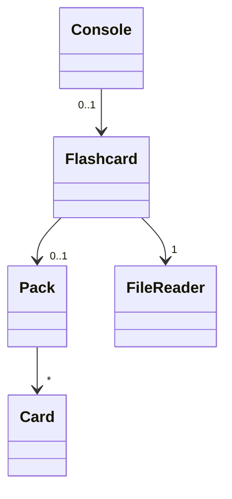
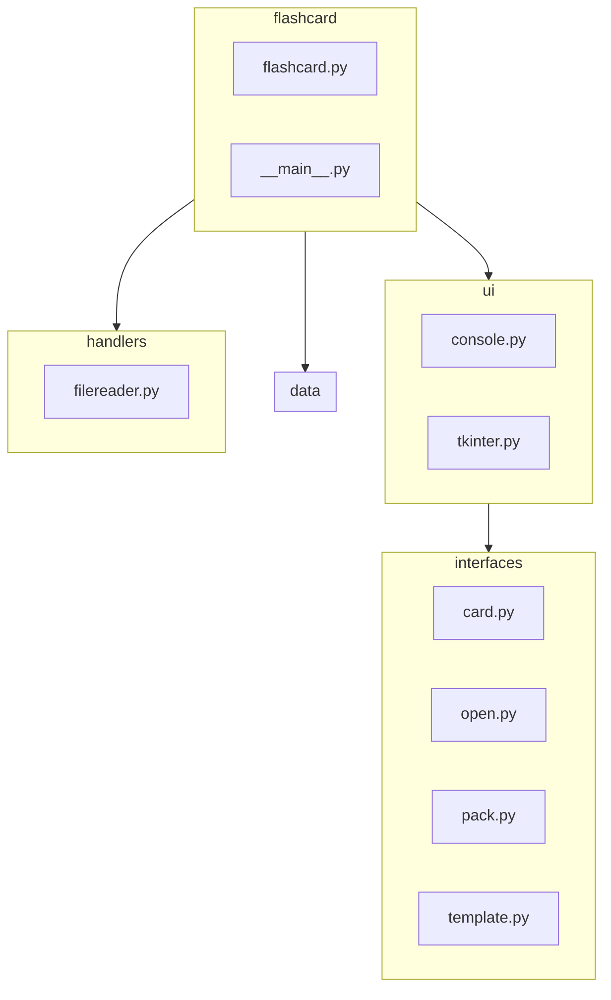
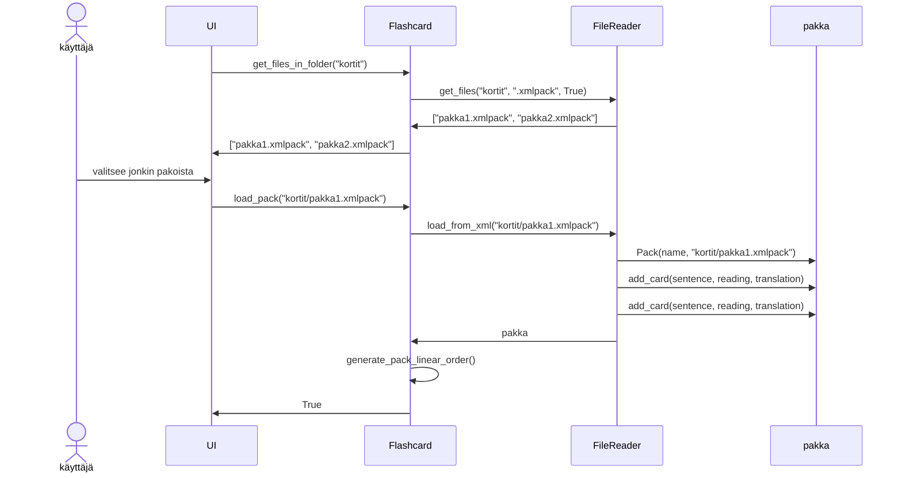
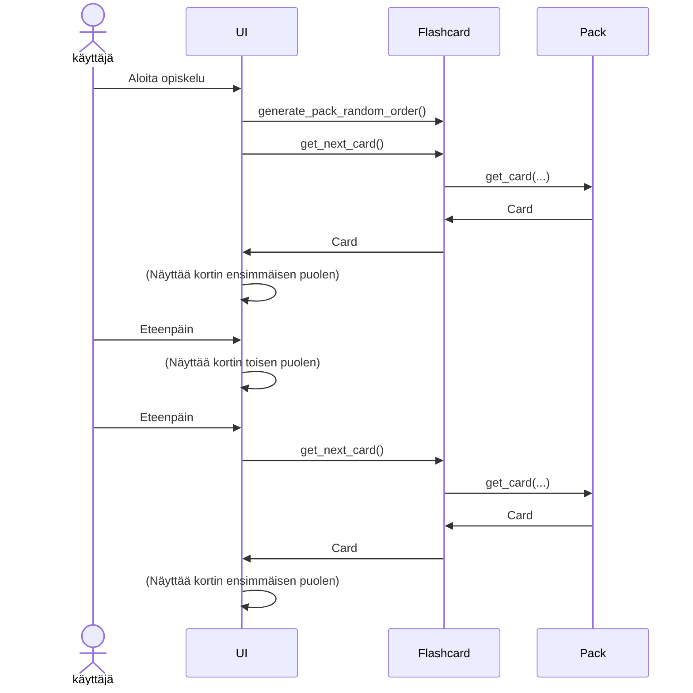
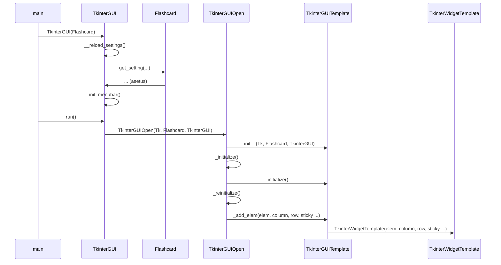
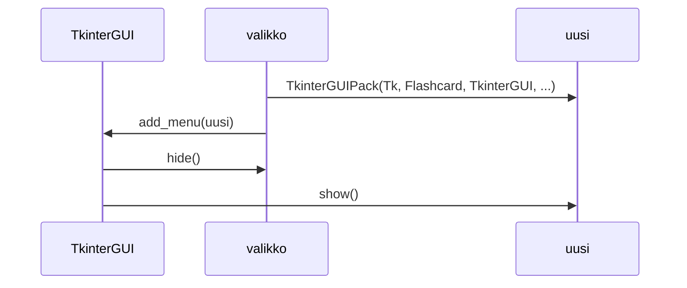

# Sovelluksen arkkitehtuuri
## Rakenne
Sovellus perustuu käyttöliittymän (kuvassa Console-luokka) ja Flashcard-luokan väliseen yhteistyöhön. Käyttöliittymä pyytää ainoastaan tarvittavat tiedot Flashcard-luokalta, joka suorittaa kortteihin liittyvät muutokset ja koordinoi niiden lataamisen ja tallentamisen yhdessä FileReader-luokan kanssa.



## Kansio- ja tiedostorakenne
Ohjelman rakenne on jaettu kolmeen kansioon
* ui (sisältää eri käyttöliittymät)
    * interfaces (sisältää tkinter näkymien luokat)
* data (sisältää ainoastaan tietoa varastoivat luokat)
* handlers (erityisesti tiedonkäsittelyyn tarkoitetut luokat)

Pääkansiosta löytyy kaksi merkittävää tiedostoa: \_\_main__.py ja flashcard.py. 

\_\_main__.py -tiedosto on ohjelman käynnistystiedosto, joka luo Flashcard- ja jonkin käyttöliittymäluokan. flashcard.py -tiedosto taas sisältää itse Flashcard-luokan ohjelmakoodin.




## Pakan lataaminen
Käyttöliittymä pyytää pakan lataamista Flashcard-luokalta, joka toimii yhteistyössä staattisen FileReader-luokan kanssa .xmlpack tiedostojen lukemisessa.

Ensin pyydetään listaa "kortit"-kansion .xmlpack tiedostoista, jonka jälkeen ladataan pakka "pakka1.xmlpack"

Alemmassa kuvassa oletetaan, että pakka1 sisältää kaksi korttia. UI tarkoittaa jotain käyttöliittymäluokkaa (kuten Console tai TkinterGUI)



Lataamisen jälkeen pakka on tallennettu Flashcard-luokkaan. Käyttöjärjestelmä voi sitten käyttää pakkaa Flashcard-luokan kautta erilaisilla komennoilla, kuten pakasta seuraavan kortin ottavalla ```get_next_card()```-komennolla tai pakan sekoittamista pyytävällä komennolla ```generate_pack_random_order()```


## Korttien tarkasteleminen

Korttien opiskelun aloittamisessa käyttöliittymä pyytää Flashcard-luokkaa sekoittamaan korttien järjestys, jonka jälkeen pyydetään aina järjestyksessä seuraavana oleva kortti metodilla UI.get_next_card()

Kortin tiedot ovat tämän jälkeen tallennettu käyttöliittymään, joka tarkoittaa ettei tietoa tarvitse erikseen pyytää uudelleen käyttäjän kääntäessä kortin (eli, kun käyttäjä päättää tarkistaa lukutavan ja käännöksen)


## Graafinen käyttöliittymä
Kahdesta käyttöliittymäluokasta monimutkaisempi Tkinter-moduulia käyttävä graafinen käyttöliittymä vaatii enemmän tilaa, jonka takia se on jaettu kahteen erilaiseen luokkaan. TkinterGUI-luokka hallinnoi kaikkia Tkinter-käyttöliittymän osapuolia, käyttäen samalla TkinterGUITemplate-rungon omaaavia luokkia valikoiden, eli käyttöliittymän, rakentamisessa.

TkinterGUI-luokan käyttö mahdollistaa sen, että valikkoja voidaan avata ja pitää muistissa samaan tapaan kuin konsolikäyttöliittymässä. TkinterGUI-luokka automaattisesti näyttää ainoastaan viimeisimmän avatun valikon, mutta pitää kirjaa kaikista avatuista valikoista, mahdollistaen peruuttamisen edelliseen näkymään.

### Graafisen käyttöliittymän käynnistys

_*Yksinkertainen näkymä graafisen käyttöliittymän käynnistämiseen. Flashcard-luokan luontia ei näytetä, eikä kaikkia komentoja esitetä tarkasti._

Graafinen käyttöliittymä lataa fonttiasetukset Flashcard-sovelluksesta TkinterGUI-luokkaa luodessa. Metodi run() lisää TkinterGUI-luokan valikkolistaan ensimmäisen valikon "TkinterGUIOpen", joka käyttää TkinterGUITemplate-luokkaa runkona. Lisättävät käyttöliittymän Tkinter-objektit (kuten napit tai tekstinpätkät) lisätään TkinterGUITemplate-rungon muistiin _add_elem()-metodilla, jolloin ne tallennetaan listalle, jotta niitä voidaan muuttaa tai esimerkiksi piilottaa tarpeen mukaan.

Luotuaan kaikki tarpeelliset Tkinter-objektit, valikkoluokka voi vielä tehdä jotain muuta, mutta tässä tilanteessa palataan takaisin TkinterGUI-luokan run()-metodiin, joka kutsuu sitten viimeiseksi Tkinter-ikkunan mainloop()-metodia.

### Toiminta uutaa valikkoa lisätessä

Valikko pystyy siis luomaan uuden valikon ja pyytämään, että se lisätään TkinterGUI-luokan valikkojen listaan. TkinterGUI-luokka sitten piilottaa aikaisemman valikon Tkinter-objektit TkinterGUITemplate-luokan metodilla hide() ja varmistaa, että uuden valikon Tkinter-objektit ovat varmasti näkyvissä TkinterGUITemplate.show()-metodilla.

## Tiedostot
Ohjelma käyttää kahta erilaista .xml-tiedostoa suorittaakseen toimintoja. Ensimmäinen on korttipakkoja ja kortteja kuvaavat .xmlpack-tiedostot, joita ohjelma voi tällä hetkellä ladata "./kortit" kansiosta. Lisäksi ohjelma lataa (tai luo, jos sellaista ei ole) setting.xml-tiedoston, joka määrittelee fontin perheen ja fonttikoon.

## .xmlpack tiedoston esimerkkimuoto
```
<pack>
    <name></name>
    <desc></desc>

    <cards>
        <card>
            <!-- Etsittävä sana ympäröity **-merkeillä -->
            <sentence>This is a **sentence**.</sentence>
            <reading>sentence</reading>
            <translation>lause</translation>
        </card>
    </cards>
</pack>
```