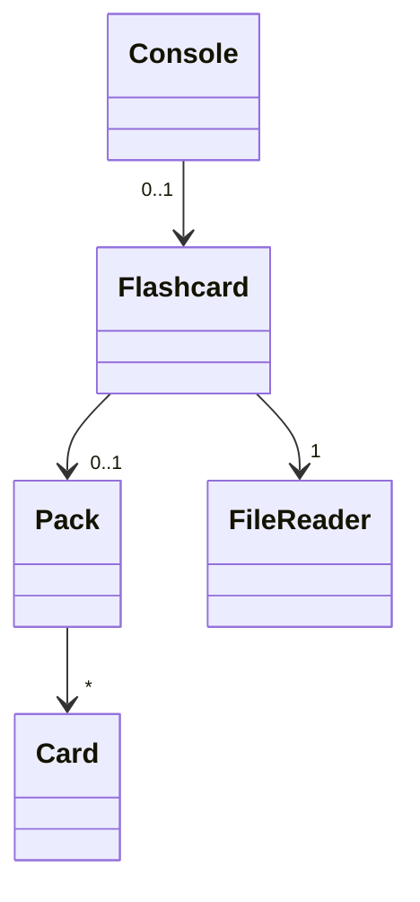
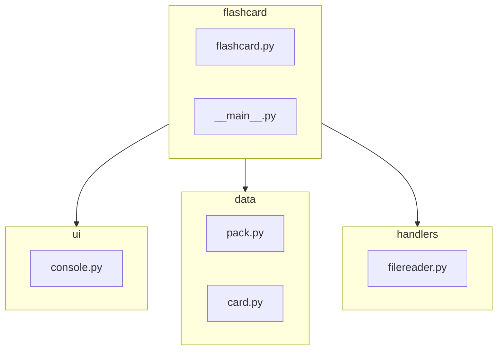

# Sovelluksen arkkitehtuuri
## Rakenne
Sovellus perustuu käyttöliittymän (kuvassa Console-luokka) ja Flashcard-luokan väliseen yhteistyöhön. Käyttöliittymä pyytää ainoastaan tarvittavat tiedot Flashcard-luokalta, joka suorittaa kortteihin liittyvät muutokset ja koordinoi niiden lataamisen ja tallentamisen yhdessä FileReader-luokan kanssa.

## Kansio- ja tiedostorakenne
Ohjelman rakenne on jaettu kolmeen luokkaan
* ui (sisältää eri käyttöliittymät)
* data (sisältää ainoastaan tietoa varastoivat luokat)
* handlers (erityisesti tiedonkäsittelyyn tarkoitetut luokat)

Pääkansiosta löytyy kaksi merkittävää tiedostoa: \_\_main__.py ja flashcard.py. 

\_\_main__.py -tiedosto on ohjelman käynnistystiedosto, joka luo Flashcard- ja jonkin käyttöliittymäluokan. flashcard.py -tiedosto taas sisältää itse Flashcard-luokan ohjelmakoodin.

