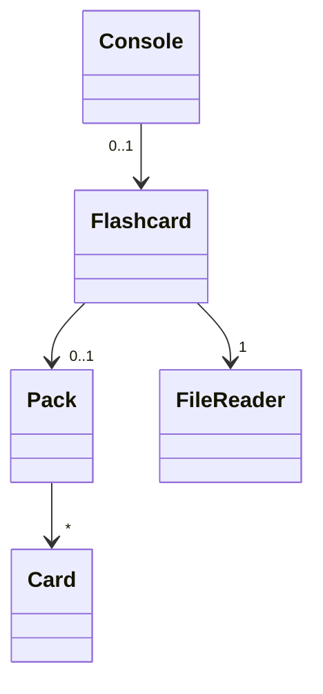
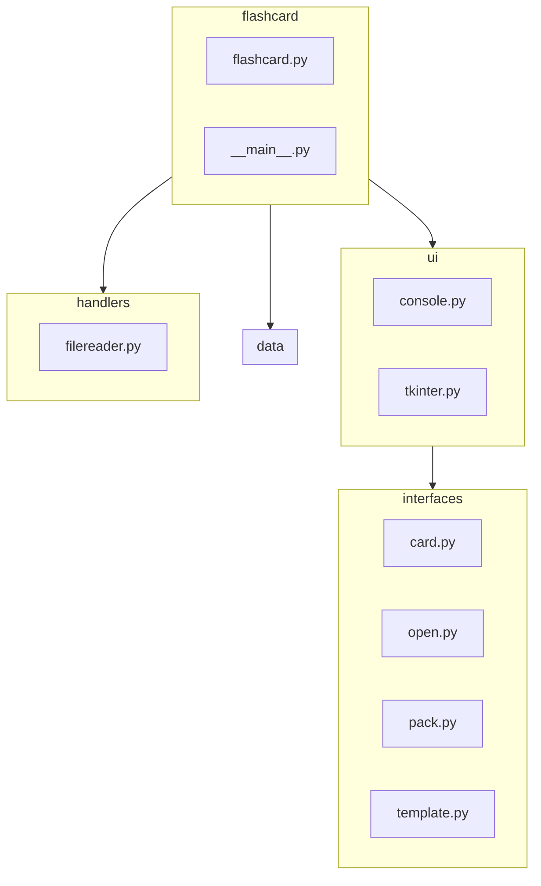
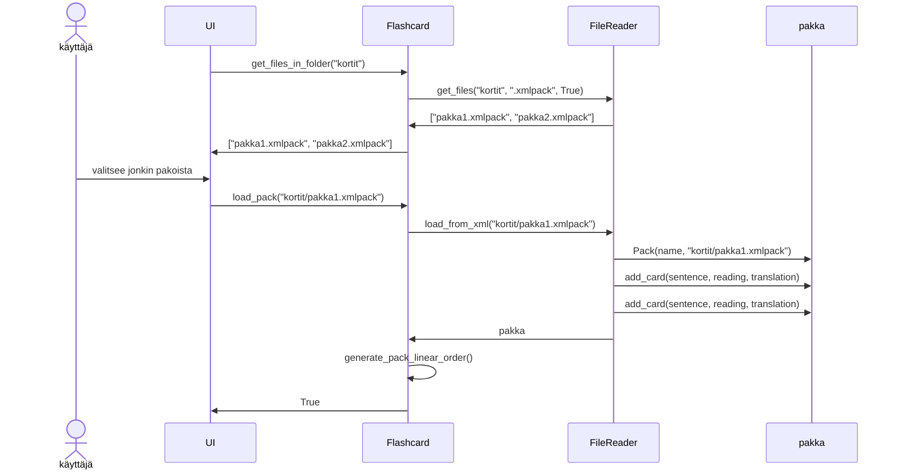

# Sovelluksen arkkitehtuuri
## Rakenne
Sovellus perustuu käyttöliittymän (kuvassa Console-luokka) ja Flashcard-luokan väliseen yhteistyöhön. Käyttöliittymä pyytää ainoastaan tarvittavat tiedot Flashcard-luokalta, joka suorittaa kortteihin liittyvät muutokset ja koordinoi niiden lataamisen ja tallentamisen yhdessä FileReader-luokan kanssa.



## Kansio- ja tiedostorakenne
Ohjelman rakenne on jaettu kolmeen luokkaan
* ui (sisältää eri käyttöliittymät)
    * interfaces (sisältää tkinter näkymien luokat)
* data (sisältää ainoastaan tietoa varastoivat luokat)
* handlers (erityisesti tiedonkäsittelyyn tarkoitetut luokat)

Pääkansiosta löytyy kaksi merkittävää tiedostoa: \_\_main__.py ja flashcard.py. 

\_\_main__.py -tiedosto on ohjelman käynnistystiedosto, joka luo Flashcard- ja jonkin käyttöliittymäluokan. flashcard.py -tiedosto taas sisältää itse Flashcard-luokan ohjelmakoodin.




## Pakan lataaminen
Käyttöliittymä pyytää pakan lataamista Flashcard-luokalta, joka toimii yhteistyössä staattisen FileReader-luokan kanssa .xmlpack tiedostojen lukemisessa.

Ensin pyydetään listaa "kortit"-kansion .xmlpack tiedostoista, jonka jälkeen ladataan pakka "pakka1.xmlpack"

Alemmassa kuvassa oletetaan, että pakka1 sisältää kaksi korttia. UI tarkoittaa jotain käyttöliittymäluokkaa (kuten Console tai TkinterGUI)



Lataamisen jälkeen pakka on tallennettu Flashcard-luokkaan. Käyttöjärjestelmä voi sitten käyttää pakkaa erilaisilla komennoilla, kuten ottamalla pakasta seuraavan kortin ```get_next_card()```-komennolla tai pyytämällä pakan sekoittamista komennolla ```generate_pack_random_order()```