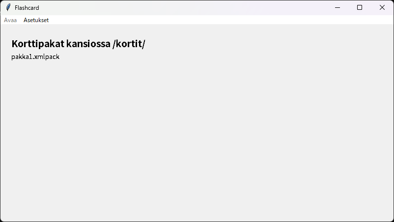
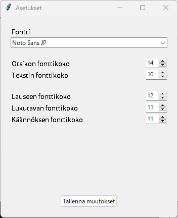
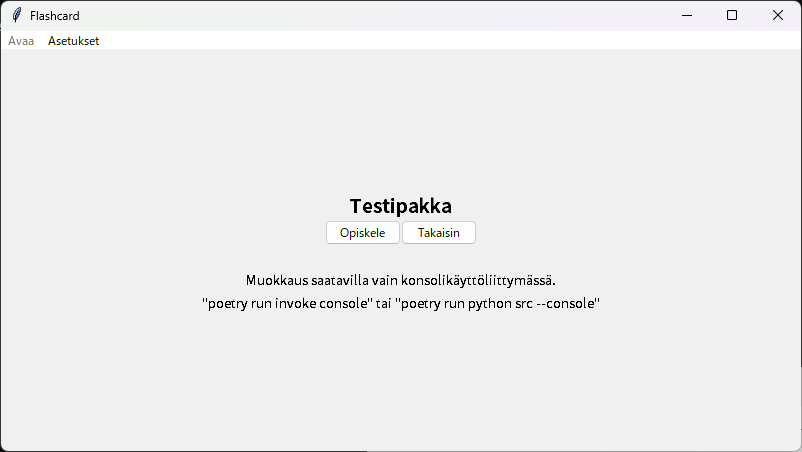
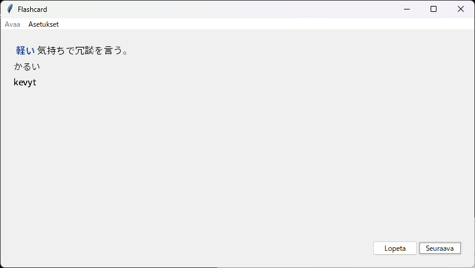
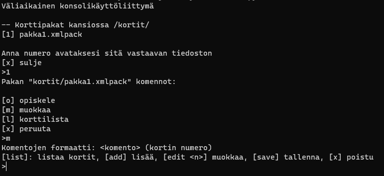
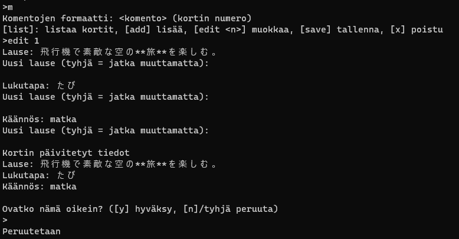

Katsothan tarkemmat vaatimukset [README.md tiedostosta](https://github.com/vkohj/ot-harjoitustyo/blob/main/README.md).

## Asennus
⚠️ Huomaathan, että alla olevat komennot suoritetaan ohjelman pääkansiossa "flashcard"!

Ohjelman voi asentaa joko ilman tai sisältäen ohjelman kehitykseen vaadittavat moduulit.

* Käyttäjälle: ```poetry install --without dev```
* Ohjelmoijalle: ```poetry install```

## Käynnistäminen

### Graafinen käyttöliittymä
* Linux: ```poetry run invoke start```
* Windows: Käynnistä ```start.bat```
* Vaihtoehtoinen: ```poetry run python src``` (Windows, Linux yms.)

### Konsolikäyttöliittymä
* Linux: ```poetry run invoke console```
* Vaihtoehtoinen: ```poetry run python src --console``` (Windows, Linux yms.)

## Graafinen käyttöliittymä
### Aloitusruutu

Aloitusruutu näyttää kaikki ohjelman kortit-kansiosta löytyvät korttipakat, joita pitäisi tulla ohjelman mukana ainakin yksi. Haluamasi pakan klikkaaminen johtaa kyseisen pakan avaamiseen.

Yllä olevasta valikosta voit avata Asetukset tai avata pakan jostain muusta kuin /kortit/-kansiosta.

Kun ohjelman käynnistää ensimmäisen kerran, kannattaan ensin käydä tarkistamassa asetukset.

### Asetukset


Asetukset-ikkuna antaa käyttäjälle mahdollisuuden määrittää käyttöliittymän fontti ja fonttikoot. Asetuksia ei tallenneta automaattisesti, vaan käyttäjän pitää painaa "Tallenna muutokset" -nappia, jonka jälkeen ohjelma tallentaa ja päivittää ohjelman fonttivalinnat.

### Pakkavalikko


Graafisen käyttöliittymän pakkavalikko on vielä tällä hetkellä tyhjä; vaihtoehtona on ainoastaan palata takaisinpäin tai opiskella kortteja. Korttien muokkaaminen on vielä tällä hetkellä saatavilla ainoastaan konsolikäyttöliittymästä.

### Korttien opiskelu


Korttien opiskeluikkunassa käyttäjä näkee ensin japaninkielisen lauseen, josta yksi sana on sinisellä värillä ja alleviivattu. Kun käyttäjä painaa "Näytä"-nappia, alleviivatun sanan lukutapa ja käännös tulevat esiin.

## Korttien muokkaaminen (Konsolikäyttöliittymä)

Valitsemalla jonkin pakan kirjoittamalla sitä vastaavan numeron konsoliin, jonka jälkeen kirjoittamalla "m"-merkin muokataksesi pakkaa, päädyt korttien muokkaamisympäristöön.


Korttien muokkaaminen ja lisääminen toimivat aikalailla samalla tavalla. Konsolikäyttöliittymä antaa yksitellen mahdollisuuden kirjoittaa uusi arvo ensin lauseelle, sitten lukutavalle ja lopuksi käännöslauseelle. Sitten ohjelma vielä varmistaa, että haluat tehdä muutokset.

Komennoissa tyhjä tarkoittaa yleensä "pidä arvo samana" tai "peruuta".

Muutoksia ei kuitenkaan vielä tallenneta, vaan se pitää tehdä erikseen tallennuskomennolla "save", tai poistumalla muokkausikkunasta ja hyväksymällä tallentamisen.