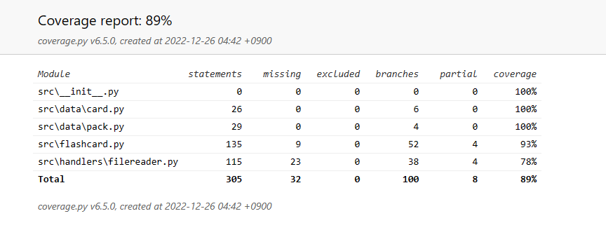

# Ohjelman testit
Tämän ohjelman loppupalautus-versio on testattu automaattisia yksikkö- ja integraatiotesteillä kuten myös manuaalisilla esimerkiksi asennukseen liittyvillä testeillä.

## Yksikkö- ja integraatiotestaus
Suurin osa ohjelmasta sisältää automaattiset testit, jotka löytyvät kansiosta src/tests. Monet testeistä vaativat testitiedostoja arvojen lataamista varten. Nämä testitiedostot ovat saatavilla kansiossa src/tests/test_files. Näitä ei tule muuttaa, jos itse testejä ei muuteta samalla.

Jokaisella luokalla on oma tiedostonsa testejään varten, kuten ```test_card.py```, ```test_filereader.py```, ```test_flashcard.py``` ja ```test_pack.py```.

Automaattisia testejä ei ole tehty käyttöliittymäluokille.

### Testauskattavuus


Aivan kaikkea ei ole testattu, kuten esimerkiksi FileReader-luokan ParseError virheiden toteutuminen tai pakan muutosta ilmaisevan muuttujan testaaminen.

## Manuaalisia testejä
Sovellus on asennettu myös Linux että Windows käyttöjärjestelmillä käyttöohjeen mukaisesti. Lisäksi ohjelma on testattu puuttuvalla asetustiedostolla ja muutamalla epämääräisellä järjestelmäasetuksella, kuten poistamalla kirjoitusoikeudet setting.xml-tiedostoon tai korttipakkoihin.