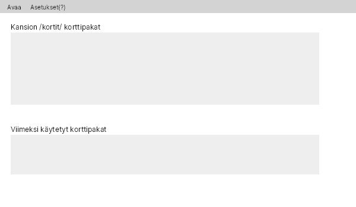
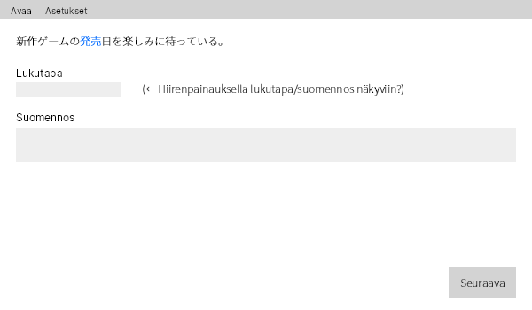
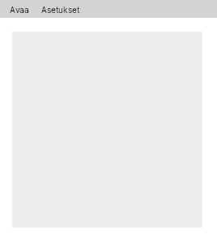

# Vaatimusmäärittely

## Tarkoitus
Sovelluksen avulla käyttäjän pystyy luomaan, hallitsemaan ja tarkastelemaan ns. suomi-japani "flashcard"-kortteja joko graafisessa tai konsolikäyttöliittymässä. Muokkaaminen on ainoastaan saatavilla konsolikäyttöliittymässä.

## Käyttöliittymä
Käyttäjän pitäisi pystyä navigoimaan käyttöliittymää ja käyttämään kortteja vaikka ei ymmärtäisi sanaakaan japania, vaikkakin itse kortit olisivatkin tällaisessa tilanteessa epäkäytännöllisiä.

#### Sovelluksen aloitus (luonnos)

#### Korttien tarkastelu (luonnos)

#### Asetukset-ikkunan muoto (luonnos)

## Toiminnallisuus

### Perusversio
- Konsolikäyttöliittymä korttien lukemiseen (tehty)
    - Kortti antaa lauseen japaniksi, josta yksi sana on alleviivattu (tehty)
    - Kortin "kääntöpuolella" löytyy esim. lukutapa ja suomen kielen vastine sanalle (tehty)
- Graafinen käyttöliittymä (tehty)
- Korttien lataus xml-tiedostosta (tehty)
- Korttien muokkaaminen ja lisääminen konsolikäyttöliittymässä (tehty)
- Korttien avaaminen valinnaisesta osoitteesta (tehty)
- Asetusten asettaminen ja lataaminen (tehty)
