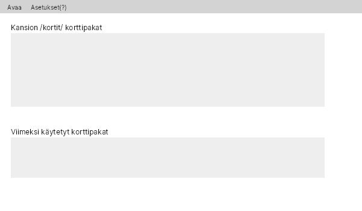
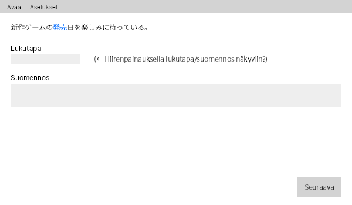
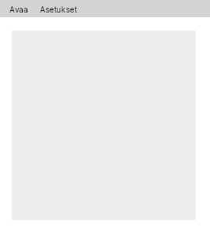

# Vaatimusmäärittely

## Tarkoitus
Sovelluksen avulla käyttäjän pitäisi pystyä luomaan, hallitsemaan ja tarkastelemaan ns. suomi-japani "flashcard"-kortteja graafisessa käyttöliittymässä.

## Käyttöliittymä
Käyttäjän pitäisi pystyä navigoimaan käyttöliittymää ja käyttämään kortteja vaikka ei ymmärtäisi sanaakaan japania, vaikkakin itse kortit olisivatkin tällaisessa tilanteessa epäkäytännöllisiä.

#### Sovelluksen aloitus

#### Korttien tarkastelu

#### Asetukset (Avautuu uuteen ikkunaan?)

## Toiminnallisuus

### Perusversio
- Konsolikäyttöliittymä korttien lukemiseen (tehty)
    - Kortti antaa lauseen japaniksi, josta yksi sana on alleviivattu (tehty)
    - Kortin "kääntöpuolella" löytyy esim. lukutapa ja suomen kielen vastine sanalle (tehty)
- Graafinen käyttöliittymä (testiversio)
- Korttien lataus xml-tiedostosta (tehty)
- Korttien muokkaaminen ja lisääminen konsolikäyttöliittymässä (tehty)
- Korttien avaaminen joko ohjelman alihakemistosta tai valinnaisesta osoitteesta

### Muuta lisättävää jne.
- Korttien muokkaus, luonti ja poisto graafisen käyttöliittymän avulla
- Käyttäjä voi kirjoittaa alleviivatun sanan lukutavan, jonka sovellus sitten toteaa oikeaksi tai vääräksi.
