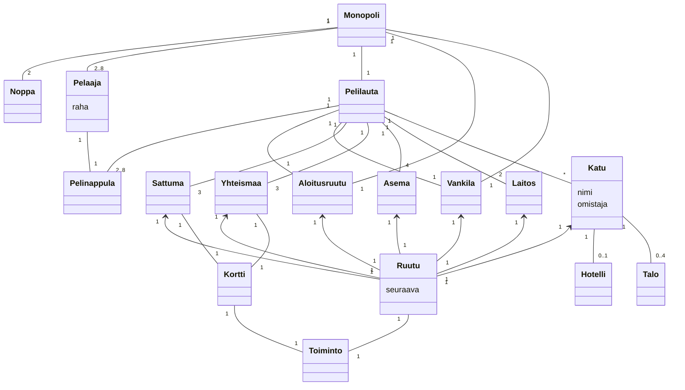

Nuolet merkitsevät perintää, jota ei näytä pystyvän toteuttamaan mermaidillä.

```mermaid
  classDiagram
        Monopoli "1" -- "2" Noppa
        Monopoli "1" -- "2..8" Pelaaja
        Monopoli "1" -- "1" Pelilauta
        
        Pelaaja "1" -- "1" Pelinappula
        Pelilauta "1" -- "2..8" Pelinappula

        Pelilauta "1" -- "1" Aloitusruutu
        Pelilauta "1" -- "1" Vankila 
        Pelilauta "1" -- "3" Sattuma 
        Pelilauta "1" -- "3" Yhteismaa
        Pelilauta "1" -- "4" Asema
        Pelilauta "1" -- "2" Laitos
        Pelilauta "1" -- "*" Katu

        Aloitusruutu "1" <-- "1" Ruutu
        Vankila "1" <-- "1" Ruutu
        Asema "1" <-- "1" Ruutu
        Laitos "1" <-- "1" Ruutu
        Katu "1" <-- "1" Ruutu
        Sattuma "1" <-- "1" Ruutu
        Yhteismaa "1" <-- "1" Ruutu

        Sattuma "1" -- "1" Kortti
        Yhteismaa "1" -- "1" Kortti
        Kortti "1" -- "1" Toiminto
        Ruutu "1" -- "1" Toiminto

        Monopoli "1" -- "1" Aloitusruutu
        Monopoli "1" -- "1" Vankila

        Katu "1" -- "0..1" Hotelli
        Katu "1" -- "0..4" Talo

        class Pelaaja {
                raha
        }

        class Ruutu {
                seuraava
        }

        class Katu {
                nimi
                omistaja
        }

        class Kortti {
        }

        
```