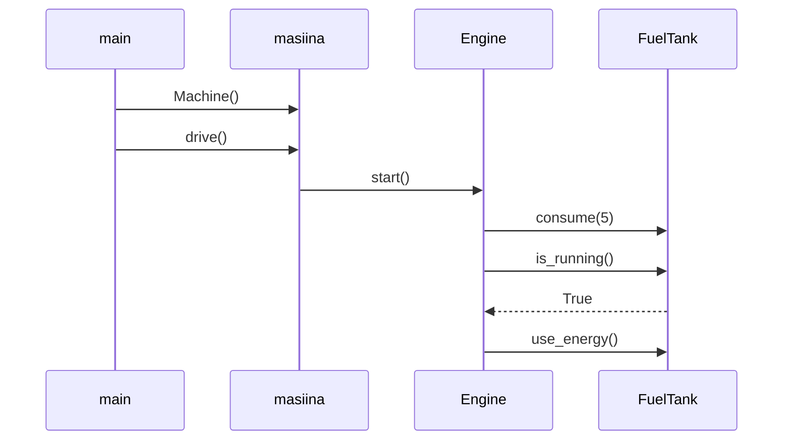

```mermaid
sequenceDiagram

  participant main
  participant masiina
  participant Engine
  participant FuelTank

  main->>masiina: Machine()
  main->>masiina: drive()
  masiina->>Engine: start()
  Engine->>FuelTank: consume(5)
  Engine->>FuelTank: is_running()
  FuelTank-->>Engine: True
  Engine->>FuelTank: use_energy()

```

